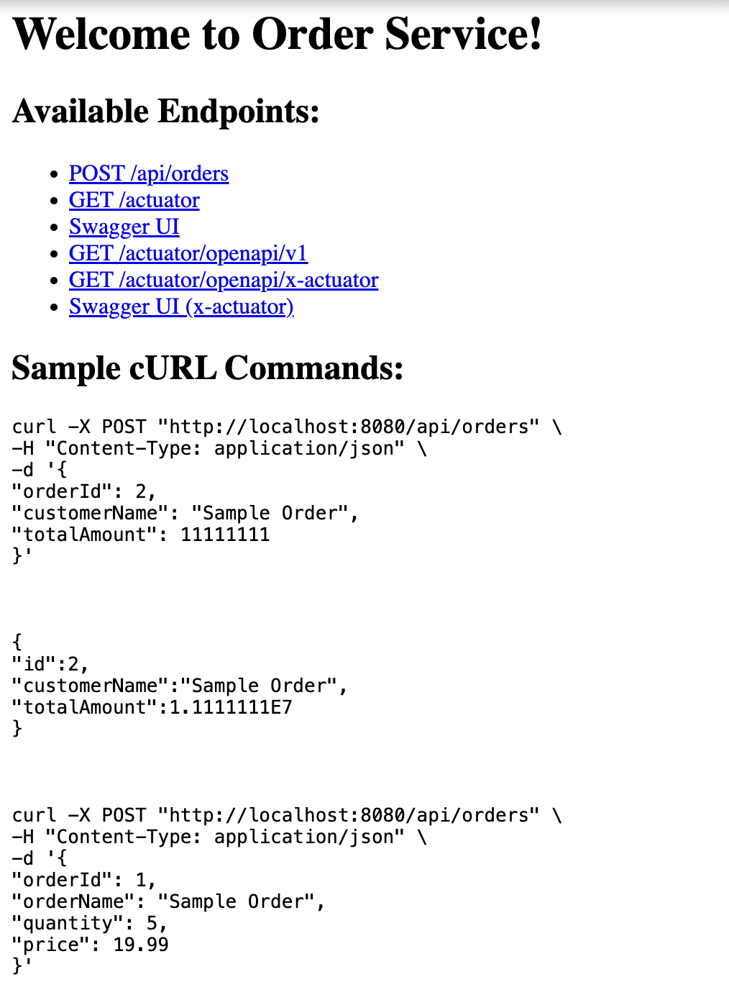

```
orderservice/
├── pom.xml
└── src
    └── main
        ├── java
        │   └── orderservice
        │       └── example
        │           └── orderservice
        │               ├── OrderserviceApplication.java
        │               ├── controller
        │               │   └── OrderController.java
        │               ├── model
        │               │   └── Order.java
        │               ├── repository
        │               │   └── OrderRepository.java
        │               └── service
        │                   └── OrderService.java
        └── resources
            ├── application.properties
            └── data.sql (optional, for initializing the database)
```

```
http://localhost:8080/
```



```
curl -X POST "http://localhost:8080/api/orders" \
     -H "Content-Type: application/json" \
     -d '{
           "orderId": 2,
           "customerName": "Sample Order",
           "totalAmount": 11111111 
         }'
```
```
{"id":2,"customerName":"Sample Order","totalAmount":1.1111111E7}  
```
```
curl -X POST "http://localhost:8080/api/orders" \
     -H "Content-Type: application/json" \
     -d '{
           "orderId": 1,
           "orderName": "Sample Order",
           "quantity": 5,
           "price": 19.99
         }'
```

```
curl -X POST "http://localhost:8080/api/orders" \
     -H "Content-Type: application/json" \
     -d '{
           "customerName": "khanna",
           "totalAmount": 5555
         }'
```

```
curl -X 'POST' \
  'http://127.0.0.1:8080/api/orders' \
  -H 'accept: application/json' \
  -H 'Content-Type: application/json' \
  -d '{
  "customerName": "string",
  "totalAmount": 0.1
}'
```

```
curl -X 'PUT' \
  'http://127.0.0.1:8080/api/orders/11' \
  -H 'accept: application/json' \
  -H 'Content-Type: application/json' \
  -d '{
  "customerName": "string",
  "totalAmount": 0.1
}'
```

```
http://localhost:9090/actuator
```

```
http://localhost:9090/actuator/swagger-ui/index.html#/
```

```
http://localhost:9090/actuator/openapi/v1
```

```
http://localhost:9090/actuator/openapi/x-actuator
```

```
http://localhost:9090/actuator/swagger-ui/index.html?urls.primaryName=x-actuator
```